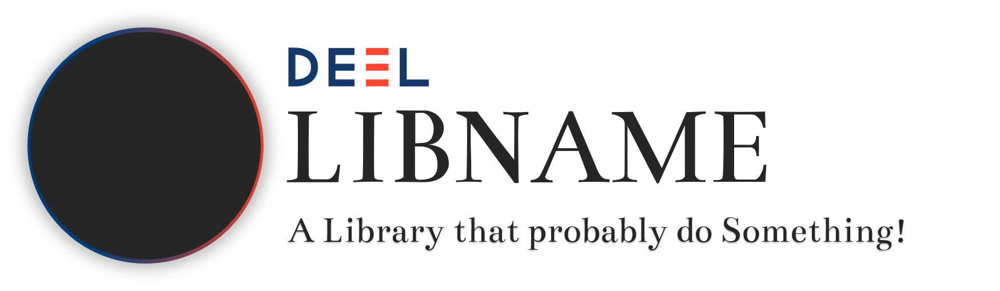

# Deel library repository template

Ce dépôt git sert de template pour les librairies DEEL ayant vocation à être rendues publiques sur github.
Il donne la structure des répertoires d'un projet telle que celle adoptée par les librairies DEEL déjà publiques.

A la racine du projet on trouve:

- deel : répertoire destiné à recevoir le code de la librairie. C'est le premier mot de l'espaces de nommage de
        la librairie. Ce n'est pas un module python, il ne contient donc pas de fichier __init__.py.
        Il contient le module principal de la librairie du nom de cette librairie.
        
        Example: 
        
        librairie **deel-lip**:
                    deel/deel-lip       

- docs: répertoire destiné à la documentation de la librairie

- tests: répertoire des tests unitaires

- .pre-commit-config.yaml : configuration de outil de contrôle avant commit (pre-commit)

- LICENCE/headers/MIT-Clause.txt : entête licence MIT injectée dans les fichiers du projet

- CONTRIBUTING.md: description de la procédure pour apporter une contribution à la librairie.

- GOUVERNANCE.md: description de la manière dont la librairie est gérée.

- LICENCE : texte de la licence sous laquelle est publiée la librairie (MIT).

- README.md 


# pre-commit : Conventional Commits 1.0.0

The commit message should be structured as follows:

```
<type>[optional scope]: <description>

[optional body]

[optional footer(s)]

```

The commit contains the following structural elements, to communicate intent to the consumers of your library:

- fix: a commit of the type fix patches a bug in your codebase (this correlates with PATCH in Semantic Versioning).

- feat: a commit of the type feat introduces a new feature to the codebase (this correlates with MINOR in Semantic Versioning).

- BREAKING CHANGE: a commit that has a footer BREAKING CHANGE:, or appends a ! after the type/scope, introduces a breaking API change (correlating with MAJOR in Semantic Versioning). A BREAKING CHANGE can be part of commits of any type.

- types other than fix: and feat: are allowed, for example @commitlint/config-conventional (based on the the Angular convention) recommends *build:, chore:, ci:, docs:, style:, refactor:, perf:, test:*, and [others](https://delicious-insights.com/fr/articles/git-hooks-et-commitlint/).
 
- footers other than BREAKING CHANGE: <description> may be provided and follow a convention similar to git trailer format.

- Additional types are not mandated by the Conventional Commits specification, and have no implicit effect in Semantic Versioning (unless they include a BREAKING CHANGE). A scope may be provided to a commit’s type, to provide additional contextual information and is contained within parenthesis, e.g., feat(parser): add ability to parse arrays.

# README sections

The following should be used as a template for the README of your library. Of course, depending on what you are doing not all sections are necessary but try to keep the order of the sections.

<!-- Banner section -->
<div align="center">
        <picture>
                <source media="(prefers-color-scheme: dark)" srcset="./docs/assets/banner_dark.png">
                <source media="(prefers-color-scheme: light)" srcset="./docs/assets/banner_light.png">
                
        </picture>
</div>
<br>

<!-- Badge section -->
<div align="center">
    <a href="#">
        
    </a>
    <a href="#">
        
    </a>
</div>
<br>

<!-- Short description of your library -->
<p align="center">
  <b>oodeel</b> is a Python toolkit dedicated to make people happy and fun.

  <!-- Link to the documentation -->
  <br>
  <a href="https://www.youtube.com/watch?v=dQw4w9WgXcQ"><strong>Explore oodeel docs »</strong></a>
  <br>

</p>

## 📚 Table of contents

- [📚 Table of contents](#-table-of-contents)
- [🔥 Tutorials](#-tutorials)
- [🚀 Quick Start](#-quick-start)
- [📦 What's Included](#-whats-included)
- [👍 Contributing](#-contributing)
- [👀 See Also](#-see-also)
- [🙏 Acknowledgments](#-acknowledgments)
- [👨‍🎓 Creator](#-creator)
- [🗞️ Citation](#-citation)
- [📝 License](#-license)

## 🔥 Tutorials

We propose some tutorials to get familiar with the library and its api:

- [Getting started](https://colab.research.google.com/drive/1XproaVxXjO9nrBSyyy7BuKJ1vy21iHs2) <sub> [](https://colab.research.google.com/github/deel-ai/<oodeel>/blob/master/docs/notebooks/demo_fake.ipynb) </sub>

You do not necessarily need to register the notebooks on the GitHub. Notebooks can be hosted on a specific [drive](https://drive.google.com/drive/folders/1DOI1CsL-m9jGjkWM1hyDZ1vKmSU1t-be).

## 🚀 Quick Start

oodeel requires some stuff and several libraries including Numpy. Installation can be done using Pypi:

```python
pip install oodeel
```

Now that oodeel is installed, here are some basic examples of what you can do with the available modules.

### Print Hello World

Let's start with a simple example:

```python
from oodeel.fake import hello_world

hello_world()
```

### Make addition

In order to add `a` to `b` you can use:

```python
from oodeel.fake import addition

a = 1
b = 2
c = addition(a, b)
```

## 📦 What's Included

A list or table of methods available

## 👍 Contributing

Feel free to propose your ideas or come and contribute with us on the oodeel toolbox! We have a specific document where we describe in a simple way how to make your first pull request: [just here](CONTRIBUTING.md).

## 👀 See Also

This library is one approach of many...

Other tools to explain your model include:

- [Random](https://www.youtube.com/watch?v=dQw4w9WgXcQ)

More from the DEEL project:

- [Xplique](https://github.com/deel-ai/xplique) a Python library exclusively dedicated to explaining neural networks.
- [deel-lip](https://github.com/deel-ai/deel-lip) a Python library for training k-Lipschitz neural networks on TF.
- [Influenciae](https://github.com/deel-ai/influenciae) Python toolkit dedicated to computing influence values for the discovery of potentially problematic samples in a dataset.
- [deel-torchlip](https://github.com/deel-ai/deel-torchlip) a Python library for training k-Lipschitz neural networks on PyTorch.
- [DEEL White paper](https://arxiv.org/abs/2103.10529) a summary of the DEEL team on the challenges of certifiable AI and the role of data quality, representativity and explainability for this purpose.

## 🙏 Acknowledgments

<div align="right">
  <picture>
    <source media="(prefers-color-scheme: dark)" srcset="https://share.deel.ai/apps/theming/image/logo?useSvg=1&v=10"  width="25%" align="right">
    <source media="(prefers-color-scheme: light)" srcset="https://www.deel.ai/wp-content/uploads/2021/05/logo-DEEL.png"  width="25%" align="right">
    
  </picture>
</div>
This project received funding from the French ”Investing for the Future – PIA3” program within the Artificial and Natural Intelligence Toulouse Institute (ANITI). The authors gratefully acknowledge the support of the <a href="https://www.deel.ai/"> DEEL </a> project.

## 👨‍🎓 Creators

If you want to highlights the main contributors


## 🗞️ Citation

If you use oodeel as part of your workflow in a scientific publication, please consider citing the 🗞️ [our paper](https://www.youtube.com/watch?v=dQw4w9WgXcQ):

```
@article{rickroll,
  title={Rickrolling},
  author={Some Internet Trolls},
  journal={Best Memes},
  year={ND}
}
```

## 📝 License

The package is released under [MIT license](LICENSE).