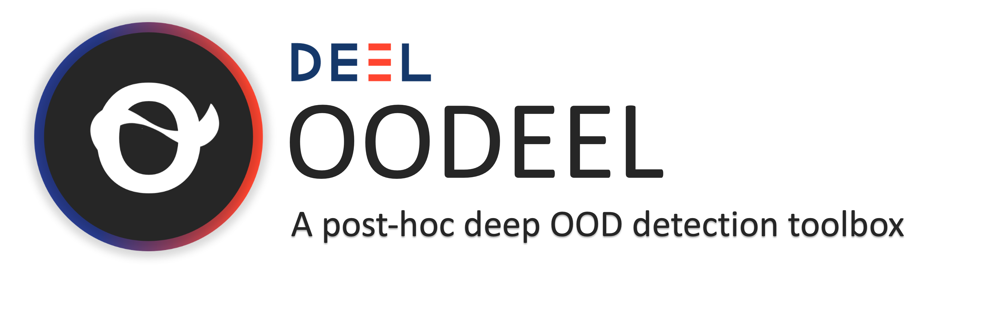

<!-- Banner section -->
<div align="center">
        <picture>
                <source media="(prefers-color-scheme: dark)" srcset="docs/assets/logo_oodeel_dark.png">
                <source media="(prefers-color-scheme: light)" srcset="docs/assets/logo_oodeel_light.png">
                
        </picture>
</div>
<br>

<!-- Badge section -->
<div align="center">
    <a href="#">
        
    </a>
    <a href="#">
        
    </a>
</div>
<br>

<!-- Short description of your library -->

<b>Oodeel</b> is a library that performs post-hoc deep OOD detection on already trained neural network image classifiers.
  **Works for keras models and will soon be available for pytorch models.** The philosophy of the library is to favor quality over quantity and to foster easy adoption. As a result, we provide a simple, compact and easily customizable API and carefully integrate and test each proposed baseline into a coherent framework that is designed to enable their use in tensorflow and (soon) pytorch.

```python
from oodeel.methods import MLS

oodmodel = MLS()
oodmodel.fit(model)
scores = oodmodel.score(ds)
```
**Disclaimer**: It is still a work in progress, see issues and [development roadmap](#-development-roadmap)

# Table of contents

- [Table of contents](#-table-of-contents)
- [Tutorials](#-tutorials)
- [Quick Start](#-quick-start)
- [What's Included](#-whats-included)
- [Development roadmap](#-development-roadmap)
- [Contributing](#-contributing)
- [See Also](#-see-also)
- [Acknowledgments](#-acknowledgments)
- [Creator](#-creator)
- [License](#-license)

# Tutorials

We propose some tutorials to get familiar with the library and its API in the [notebooks directory](notebooks)

# Quick Start

**Oodeel** requires some stuff and several libraries including Numpy. Installation can be done using Pypi:

```python
git clone https://github.com/Jingkang50/OpenOOD.git
cd oodeel
make prepare-dev
```

Now that *oodeel* is installed, here are some basic examples of what you can do with the available modules. See also the notebooks directory for more advanced examples.

## For benchmarking with one dataset as in-distribution and another as out-of-distribution

Load in-distribution and out-of-distribution datasets.

```python
from oodeel.datasets import OODDataset

ds_in = OODDataset('mnist', split="test").prepare(batch_size)
ds_out = OODDataset('fashion_mnist', split="test").prepare(batch_size)
```

## For benchmarking with one dataset as in-distribution and another as out-of-distribution

Load a dataset and split it into an in-distribution dataset and ou-of-distribution dataset depending on its label values (common practice of anomaly detection and open set recognition).

```python
from oodeel.datasets import OODDataset

in_labels = [0, 1, 2, 3, 4]
oods_in, oods_out = oods_test.assign_ood_labels_by_class(in_labels=in_labels)
ds_in = oods_in.prepare(batch_size=batch_size)
ds_out = oods_out.prepare(batch_size=batch_size)
```
## Run an OOD method

Load an OOD method and use it on an already trained model

```python
from oodeel.methods import MLS

oodmodel = MLS()
oodmodel.fit(model)
scores_in = oodmodel.score(ds_in)
scores_out = oodmodel.score(ds_in)
```

Evaluate the method

```python
from oodeel.eval.metrics import bench_metrics

metrics = bench_metrics(
    (scores_in, scores_out),
    metrics = ["auroc", "fpr95tpr"],
    )
```


# What's Included

The library is based on a class, `OODModel`, that fits a model and then scores new samples. Some baselines use extra data, so `OODmodel` can also fit additional data if needed. The library uses `OODDataset` to properly load data from different sources and prepare it for OOD detection. It can perform OOD-specific operations like adding extra OOD data for tuning with Outlier Exposure or filters according to label values for anomaly detection or open set recognition benchmarks.

Currently, **oodeel** includes the following baselines:


|  Name   |  Link   | Venue |
| --- | --- | --- |
| MLS | [Open-Set Recognition: a Good Closed-Set Classifier is All You Need?](http://arxiv.org/abs/2110.06207) | ICLR 2022 |
| MSS | [A Baseline for Detecting Misclassified and Out-of-Distribution Examples in Neural Networks](http://arxiv.org/abs/1610.02136) | ICLR 2017 |
| Mahalanobis | [A Simple Unified Framework for Detecting Out-of-Distribution Samples and Adversarial Attacks](http://arxiv.org/abs/1807.03888) | NeurIPS 2018 |
| Energy | [Energy-based Out-of-distribution Detection](http://arxiv.org/abs/2010.03759) | NeurIPS 2020 |
| Odin | [Enhancing The Reliability of Out-of-distribution Image Detection in Neural Networks](http://arxiv.org/abs/1706.02690) | ICLR 2018 |
| DKNN | [Out-of-Distribution Detection with Deep Nearest Neighbors](http://arxiv.org/abs/2204.06507) | ICML 2022 |
| VIM | [ViM: Out-Of-Distribution with Virtual-logit Matching](http://arxiv.org/abs/2203.10807) | CVPR 2022 |

**Oodeel** also includes standard training functions with data augmentation and learning rate scheduler for models from `keras.applications` in [training_funs](models/training_funs) directory. These functions come in handy for benchmarks like *leave-k-classes-out* that require retraining models on a subset of dataset classes.
# Develoment Roadmap

## Roadmap to first release:
- [x] The library works for `keras` models
- [ ] Unification of tutorial notebooks
- [ ] Validation of all methods for pytorch using `TorchOperator`, making oodeel compatible with both tensorflow and pytorch models.
- [ ] Integration of `TorchDataHandler` to alleviate the need of `tf.data.Dataset` when using pytorch. At this stage, oodeel will no more require any tensorflow components when using pytorch, and vice-versa.
- [ ] Revise docstring and type hinting
- [ ] Set up the doc

## What's next ?
- [ ] More baselines !
- [ ] A module for thorough visualizations (result plots and feature space visualizations)
- [ ] Integrate model loading and uploading with [hugginface's transformers](https://huggingface.co/docs/transformers/index) library for pretraining
- [ ] Extend the library to more diverse tasks like object detection, segmentation, NLP ...
- [ ] Towards OOD Generalization?

# Contributing

Feel free to propose your ideas or come and contribute with us on the oodeel toolbox! We have a specific document where we describe in a simple way how to make your first pull request: [just here](CONTRIBUTING.md).

# See Also

Other great tools in the field of OOD:

- [OpenOOD](https://github.com/Jingkang50/OpenOOD): Benchmarking Generalized Out-of-Distribution Detection
- [ADBench](https://github.com/Minqi824/ADBench): Official Implement of "ADBench: Anomaly Detection Benchmark".
- [PyOD](https://github.com/yzhao062/pyod): A Comprehensive and Scalable Python Library for Outlier Detection (Anomaly Detection)
- [Anomalib](https://github.com/openvinotoolkit/anomalib): An anomaly detection library comprising state-of-the-art algorithms and features such as experiment management, hyper-parameter optimization, and edge inference.

More from the DEEL project:

- [Xplique](https://github.com/deel-ai/xplique) a Python library exclusively dedicated to explaining neural networks.
- [deel-lip](https://github.com/deel-ai/deel-lip) a Python library for training k-Lipschitz neural networks on TF.
- [Influenciae](https://github.com/deel-ai/influenciae) Python toolkit dedicated to computing influence values for the discovery of potentially problematic samples in a dataset.
- [deel-torchlip](https://github.com/deel-ai/deel-torchlip) a Python library for training k-Lipschitz neural networks on PyTorch.
- [DEEL White paper](https://arxiv.org/abs/2103.10529) a summary of the DEEL team on the challenges of certifiable AI and the role of data quality, representativity and explainability for this purpose.

# Acknowledgments

<div align="right">
  <picture>
    <source media="(prefers-color-scheme: dark)" srcset="docs/assets/deel_dark.png"  width="25%" align="right">
    <source media="(prefers-color-scheme: light)" srcset="docs/assets/deel_light.png"  width="25%" align="right">
    
  </picture>
</div>
This project received funding from the French ”Investing for the Future – PIA3” program within the Artificial and Natural Intelligence Toulouse Institute (ANITI). The authors gratefully acknowledge the support of the <a href="https://www.deel.ai/"> DEEL </a>, a research project jointly conducted in France and Quebec.

# Creators

The library was created by Paul Novello to streamline DEEL research on post-hoc deep OOD methods and foster their adoption by DEEL industrial partners. He was soon joined by Yann Pequignot, Yannick Prudent, Corentin Friedrich and Matthieu Le Goff.

# License

The package is released under [MIT license](LICENSE).
