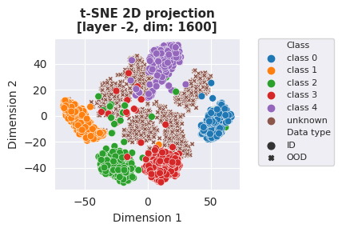

<!-- Banner section -->
<div align="center">
        <picture>
                <source media="(prefers-color-scheme: dark)" srcset="docs/assets/oodeel_dark.png">
                <source media="(prefers-color-scheme: light)" srcset="docs/assets/oodeel_light.png">
                
        </picture>
</div>
<br>

<!-- Badge section -->
<div align="center">
    <a href="#">
        
    </a>
    <a href="https://github.com/deel-ai/oodeel/actions/workflows/python-linters.yml">
        
    </a>
    <a href="https://github.com/deel-ai/oodeel/actions/workflows/python-tests-tf.yml">
        
    </a>
    <a href="https://github.com/deel-ai/oodeel/actions/workflows/python-tests-torch.yml">
        
    </a>
    <a href="https://github.com/deel-ai/oodeel/actions/workflows/python-coverage-shield.yml">
        
    </a>
    <a href="https://github.com/deel-ai/oodeel/blob/master/LICENSE">
        
    </a>
</div>
<br>

<!-- Short description of your library -->

<b>Oodeel</b> is a library that performs post-hoc deep OOD detection on already trained neural network image classifiers. The philosophy of the library is to favor quality over quantity and to foster easy adoption. As a result, we provide a simple, compact and easily customizable API and carefully integrate and test each proposed baseline into a coherent framework that is designed to enable their use in tensorflow **and** pytorch. You can find the documentation [here](https://deel-ai.github.io/oodeel/).

```python
from oodeel.methods import MLS

mls = MLS()
mls.fit(model) # A tensorflow or torch model
scores, info = mls.score(ds) # ds is a tf.data.Dataset or a torch.DataLoader
```

# Table of contents

- [Installation](#installation)
- [Quick Start](#quick-start)
- [Tutorials](#tutorials)
- [What's Included](#whats-included)
- [Development roadmap](#development-roadmap)
- [Contributing](#contributing)
- [See Also](#see-also)
- [Acknowledgments](#acknowledgments)
- [Creator](#creator)
- [License](#license)

# Installation

Installation can be done using:

```bash
pip install oodeel
```

oodeel requires either `tensorflow` or `pytorch` to be already installed (it will not install them automatically not to mess-up with existing installations). It is regularly tested with:

|Python version|Pytorch version|Tensorflow version|
|---|---|---|
|`3.8`| `1.11`| `2.5`|
|`3.9`|`1.13` | `2.8`|
|`3.10`| `2.00` | `2.11`|

# Quick Start

Now that *oodeel* is installed, here are some basic examples of what you can do with the available modules. See also the notebooks directory for more advanced examples.

### For benchmarking with one dataset as in-distribution and another as out-of-distribution

Load in-distribution and out-of-distribution datasets.

```python
from oodeel.datasets import OODDataset

ds_in = OODDataset(
  'mnist', load_kwargs={"split":"test"},
  backend="tensorflow").prepare(batch_size) # use backend="torch" if you prefer torch.DataLoader
ds_out = OODDataset(
  'fashion_mnist', load_kwargs={"split":"test"},
  backend="tensorflow").prepare(batch_size)
```

### For benchmarking with a classes subset as in-distribution and another classes subset as out-of-distribution

Load a dataset and split it into an in-distribution dataset and ou-of-distribution dataset depending on its label values (a common practice of anomaly detection and open set recognition).

```python
from oodeel.datasets import OODDataset

in_labels = [0, 1, 2, 3, 4]
oods_in, oods_out = oods_test.split_by_class(in_labels=in_labels)
ds_in = oods_in.prepare(batch_size=batch_size)
ds_out = oods_out.prepare(batch_size=batch_size)
```
### Run an OOD method

Load an OOD method and use it on an already-trained model

```python
from oodeel.methods import MLS

mls = MLS()
mls.fit(model)
# info contains model predictions and labels if avail
scores_in, info_in = mls.score(ds_in)
scores_out, info_out = mls.score(ds_out)
```

Evaluate the method

```python
from oodeel.eval.metrics import bench_metrics

metrics = bench_metrics(
    (scores_in, scores_out),
    metrics = ["auroc", "fpr95tpr"],
    )
```

### And visualize the results!

2D t-SNE (3D is also available).

```python
plot_2D_features(
    model=model,
    in_dataset=ds_in,
    out_dataset=ds_out,
    output_layer_id=-2,
)
```
<p align="center">
  
</p>

Classical histograms and AUROC curve.
```python
plot_ood_scores(scores_in, scores_out, log_scale=False)
plot_roc_curve(scores_in, scores_out)
```
<p align="center">
  
</p>

# Tutorials

We propose some tutorials to get familiar with the library and its API. See the Tutorial section of the [doc](https://deel-ai.github.io/oodeel/)


# What's Included

The library is based on a class, `OODBaseDetector`, that fits a model and then scores new samples. Some baselines use extra data, so `OODBaseDetector` can also fit additional data if needed. The library uses `OODDataset` to properly load data from different sources and prepare it for OOD detection. It can perform OOD-specific operations like adding extra OOD data for tuning with Outlier Exposure or filters according to label values for anomaly detection or open set recognition benchmarks.

Currently, **oodeel** includes the following baselines:


|  Name   |  Link   | Venue | Status |
| --- | --- | --- | --- |
| MLS | [Open-Set Recognition: a Good Closed-Set Classifier is All You Need?](http://arxiv.org/abs/2110.06207) | ICLR 2022 | avail [tensorflow & torch](docs/pages/getting_started.ipynb) |
| MSP | [A Baseline for Detecting Misclassified and Out-of-Distribution Examples in Neural Networks](http://arxiv.org/abs/1610.02136) | ICLR 2017 | avail [tensorflow & torch](docs/pages/getting_started.ipynb)|
| Mahalanobis | [A Simple Unified Framework for Detecting Out-of-Distribution Samples and Adversarial Attacks](http://arxiv.org/abs/1807.03888) | NeurIPS 2018 | avail [tensorflow](docs/notebooks/tensorflow/demo_mahalanobis_tf.ipynb) or  [torch](docs/notebooks/torch/demo_mahalanobis_torch.ipynb)|
| Energy | [Energy-based Out-of-distribution Detection](http://arxiv.org/abs/2010.03759) | NeurIPS 2020 |avail [tensorflow](docs/notebooks/tensorflow/demo_energy_tf.ipynb) or  [torch](docs/notebooks/torch/demo_energy_torch.ipynb)  |
| Odin | [Enhancing The Reliability of Out-of-distribution Image Detection in Neural Networks](http://arxiv.org/abs/1706.02690) | ICLR 2018 |avail [tensorflow](docs/notebooks/tensorflow/demo_odin_tf.ipynb) or  [torch](docs/notebooks/torch/demo_odin_torch.ipynb) |
| DKNN | [Out-of-Distribution Detection with Deep Nearest Neighbors](http://arxiv.org/abs/2204.06507) | ICML 2022 | avail [tensorflow](docs/notebooks/tensorflow/demo_dknn_tf.ipynb) or  [torch](docs/notebooks/torch/demo_dknn_torch.ipynb) |
| VIM | [ViM: Out-Of-Distribution with Virtual-logit Matching](http://arxiv.org/abs/2203.10807) | CVPR 2022 |avail [tensorflow](docs/notebooks/tensorflow/demo_vim_tf.ipynb) or  [torch](docs/notebooks/torch/demo_vim_torch.ipynb)  |
| Entropy | [Likelihood Ratios for Out-of-Distribution Detection](https://proceedings.neurips.cc/paper/2019/hash/1e79596878b2320cac26dd792a6c51c9-Abstract.html) | NeurIPS 2019 |avail [tensorflow](docs/notebooks/tensorflow/demo_entropy_tf.ipynb) or  [torch](docs/notebooks/torch/demo_entropy_torch.ipynb)  |
| GODIN | [Generalized ODIN: Detecting Out-of-Distribution Image Without Learning From Out-of-Distribution Data](https://ieeexplore.ieee.org/document/9156473/) | CVPR 2020 | planned |
| ReAct | [ReAct: Out-of-distribution Detection With Rectified Activations](http://arxiv.org/abs/2111.12797) | NeurIPS 2021 | avail [tensorflow](docs/notebooks/tensorflow/demo_react_tf.ipynb) or  [torch](docs/notebooks/torch/demo_react_torch.ipynb) |
| NMD | [Neural Mean Discrepancy for Efficient Out-of-Distribution Detection](https://openaccess.thecvf.com/content/CVPR2022/html/Dong_Neural_Mean_Discrepancy_for_Efficient_Out-of-Distribution_Detection_CVPR_2022_paper.html) | CVPR 2022 | planned |
| Gram | [Detecting Out-of-Distribution Examples with Gram Matrices](https://proceedings.mlr.press/v119/sastry20a.html) | ICML 2020 | planned |


**Oodeel** also includes standard training functions with data augmentation and learning rate scheduler for toy convnet models or models from `keras.applications` in [tf_training_tools.py](https://github.com/deel-ai/oodeel/tree/master/oodeel/utils/tf_training_tools.py) and `torchvision.models` in [torch_training_tools.py](https://github.com/deel-ai/oodeel/tree/master/oodeel/utils/torch_training_tools.py) files. These functions come in handy for benchmarks like *leave-k-classes-out* that requires retraining models on a subset of dataset classes.
# Development Roadmap

- [ ] More baselines!
- [x] A module for thorough visualizations (result plots and feature space visualizations)
- [ ] Integrate model loading and uploading with [hugginface's transformers](https://huggingface.co/docs/transformers/index) library for pretraining
- [ ] Extend the library to more diverse tasks like object detection, segmentation, NLP ...
- [ ] Towards OOD Generalization?

# Contributing

Feel free to propose your ideas or come and contribute with us on the oodeel toolbox! We have a specific document where we describe in a simple way how to make your first pull request: [just here](CONTRIBUTING.md).

# See Also

Other great tools in the field of OOD:

- [OpenOOD](https://github.com/Jingkang50/OpenOOD): Benchmarking Generalized Out-of-Distribution Detection
- [Pytorch-OOD](https://github.com/kkirchheim/pytorch-ood): Out-of-Distribution (OOD) Detection with Deep Neural Networks based on PyTorch.
- [ADBench](https://github.com/Minqi824/ADBench): Official Implement of "ADBench: Anomaly Detection Benchmark".
- [PyOD](https://github.com/yzhao062/pyod): A Comprehensive and Scalable Python Library for Outlier Detection (Anomaly Detection)
- [Anomalib](https://github.com/openvinotoolkit/anomalib): An anomaly detection library comprising state-of-the-art algorithms and features such as experiment management, hyper-parameter optimization, and edge inference.

More from the DEEL project:

- [Xplique](https://github.com/deel-ai/xplique) a Python library exclusively dedicated to explaining neural networks.
- [deel-lip](https://github.com/deel-ai/deel-lip) a Python library for training k-Lipschitz neural networks on TF.
- [Influenciae](https://github.com/deel-ai/influenciae) Python toolkit dedicated to computing influence values for the discovery of potentially problematic samples in a dataset.
- [deel-torchlip](https://github.com/deel-ai/deel-torchlip) a Python library for training k-Lipschitz neural networks on PyTorch.
- [DEEL White paper](https://arxiv.org/abs/2103.10529) a summary of the DEEL team on the challenges of certifiable AI and the role of data quality, representativity and explainability for this purpose.

# Acknowledgments

<div align="right">
  <picture>
    <source media="(prefers-color-scheme: dark)" srcset="docs/assets/deel_dark.png"  width="25%" align="right">
    <source media="(prefers-color-scheme: light)" srcset="docs/assets/deel_light.png"  width="25%" align="right">
    
  </picture>
</div>
This project received funding from the French ”Investing for the Future – PIA3” program within the Artificial and Natural Intelligence Toulouse Institute (ANITI). The authors gratefully acknowledge the support of the <a href="https://www.deel.ai/"> DEEL </a>, a research project jointly conducted in France and Quebec.

# Creators

The library was created by Paul Novello to streamline DEEL research on post-hoc deep OOD methods and foster their adoption by DEEL industrial partners. He was soon joined by Yann Pequignot, Yannick Prudent, Corentin Friedrich and Matthieu Le Goff.

# License

The package is released under [MIT license](LICENSE).
